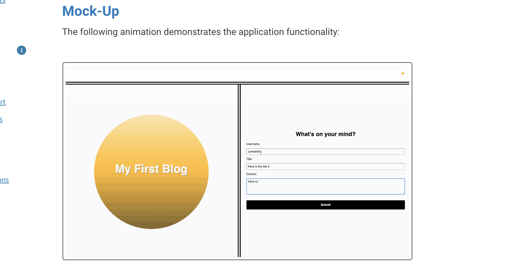
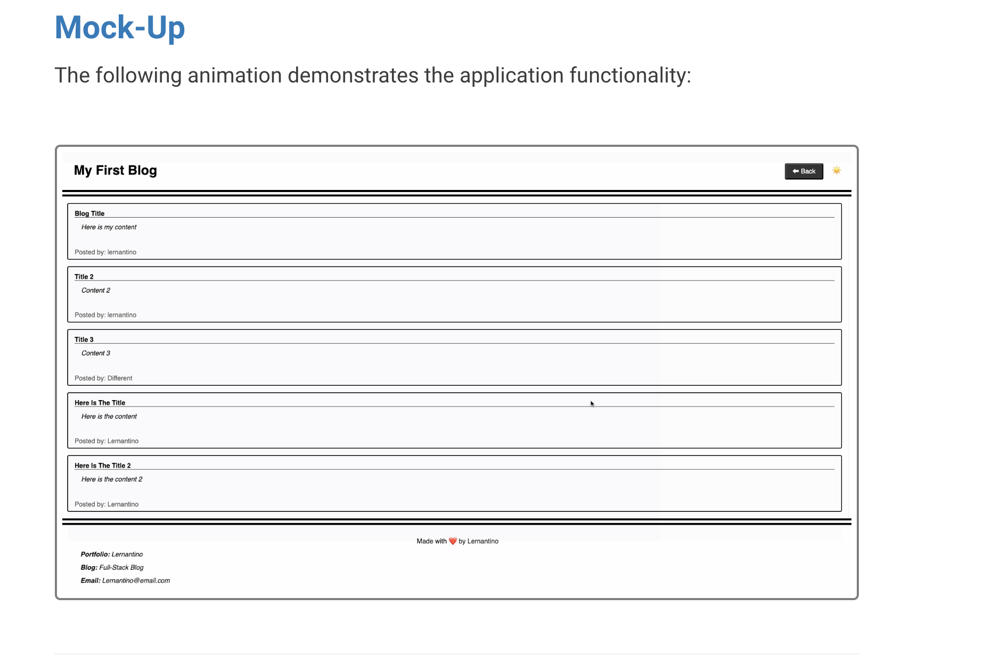
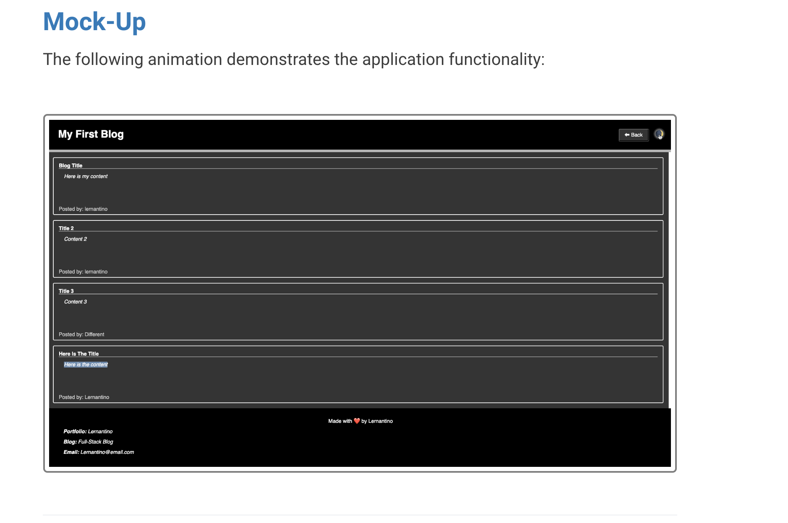
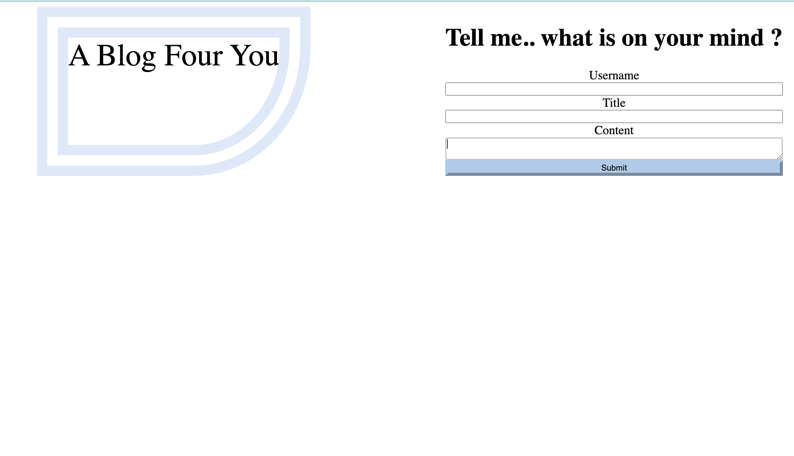
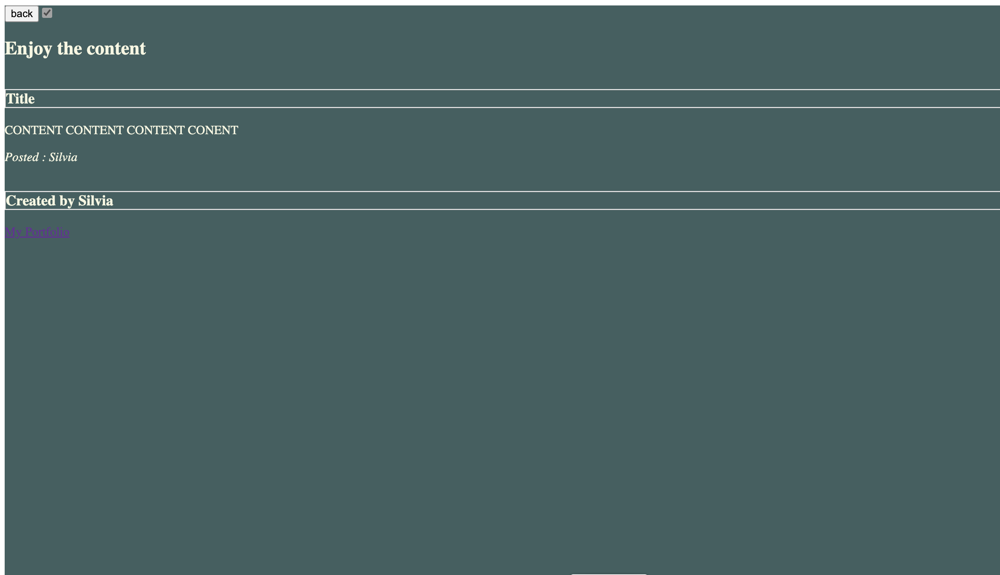

# Four-Personal-Blog
Welcome, In this repository you will see the first three images of the mock up challege that is expected, 
the following three images you will see the two page website where users will input and view blog posts.
and the data that is input will be stored into the local storgae.
## Mock UP Expected
The expected mock up images presented.

 

## My Two Page Blog 
# First page 
It presents the input area for Username , Title, Content
All of this information will be stored into the local Storage and be directed into the second page 

# Second page
Presents the Title, content and username all collected form the first page  

# Second Page
You are present at the top a back button where it will direct you to the first page ,
also a checkbox switch will let you chnage the into dark mood in this case i choose a differnt color 

## Contact
* Deployed Website : https://s-via.github.io/Four-Personal-Blog/
* Git Hub Repo : https://github.com/S-via/Four-Personal-Blog.git
## Refrences 
* Toggle button : https://www.w3schools.com/howto/tryit.asp?filename=tryhow_css_switch
* Toggle button -Xpert learning
* Required Tag : https://www.w3schools.com/tags/tryit.asp?filename=tryhtml5_input_required
* For loop with backticks - Tutor Rene
* Correction for array with no function - TA Gunjan 

